```mermaid
stateDiagram-v2
direction LR
[*] --> rootmake
rootmake --> submake
rootmake: make
folder: 📂 package-manager
state folder {
	direction LR
	submake: make
	submake --> curl
	curl --> bash : brew.sh
	bash
}
bash --> [*]
```

```mermaid
stateDiagram-v2
direction LR
[*] --> rootmake
rootmake --> submake
rootmake: make
folder: 📂 go-task
state folder {
	direction LR
	submake: make
	submake --> dnf
}
dnf --> [*]
```

```mermaid
stateDiagram-v2
direction LR
[*] --> rootmake
rootmake --> task
rootmake: make
folder: 📂 shell
state folder {
	direction LR
	task
	%% etcfiles
	etcfiles: /etc
	task --> etc_perl
	state etcfiles {
		direction LR
		etc_perl: perl
		etc_perl --> install
	}

	%% config
	config: $XDG_CONFIG_HOME/zsh
	config_mkdir: mkdir
	task --> config_mkdir
	config_mkdir --> config_build
	state config {
		direction LR
		config_build: build
		config_cp: cp
		config_build --> config_cp
		config_cp --> fragments_mkdir
		fragments: ./fragments
		state fragments {
			fragments_mkdir: mkdir
			fragments_cp: cp
			fragments_mkdir --> fragments_cp
		}
	}

	%% data
	data: $XDG_DATA_HOME/zsh
	data_mkdir: mkdir
	task --> data_mkdir
	data_mkdir --> functions
	data_mkdir --> plugins
	state data {
		direction LR
		functions: ./functions
		state functions {
			direction LR
			functions_mkdir: mkdir
			functions_cp: cp
			functions_mkdir --> functions_cp
		}
		plugins: ./plugins
		state plugins {
			direction LR
			plugins_mkdir: mkdir
			plugins_cp: cp
			plugins_mkdir --> plugins_cp
		}
	}
}
```

# Design Principle
Each bootstrap fragments / scripts / recipes should be organised by folder and executed per folder using `make`:

```mermaid
block-beta
columns 7
make("make")
space:2
block:block1:4
	columns 1
	item1("📂 package-manager")
	item2("📂 go-task")
    item3("📂 shell")
	item4("📂 nvim")
    item5["..."]
end
make --> block1
```

# Design Details
## package-manager
### macOS
|attributes|description|
|--|--|
|recipe language|`make`|
|command|`make package-manager`|
|installed artifacts|`homebrew`|
#### flow

### Windows
#### attributes
|attributes|description|
|--|--|
|recipe language|`powershell`|
|command|`.\make.ps1 package-manager`|
|installed artifacts|`winget`|
#### flow

## go-task
### macOS
|attributes|description|
|--|--|
|recipe language|`make`|
|command|`make go-task`|
|installed artifacts|`go-task`|
#### flow

```mermaid
stateDiagram-v2
direction LR
[*] --> rootmake
rootmake --> submake
rootmake: make
folder: 📂 go-task
state folder {
	direction LR
	submake: make
	submake --> brew
}
brew --> [*]
```

### Debian-alike
|attributes|description|
|--|--|
|recipe language|`make`|
|command|`make go-task`|
|installed artifacts|`task`|
#### flow

### RHEL-alike
|attributes|description|
|--|--|
|recipe language|`make`|
|command|`make go-task`|
|installed artifacts|`go-task`|
#### flow

### Windows
|attributes|description|
|--|--|
|recipe language|`make`|
|command|`.\make.ps1 go-task`|
|installed artifacts|`Task.Task`|
#### flow

```mermaid
stateDiagram-v2
direction LR
[*] --> rootmake
rootmake --> submake
rootmake: make.ps1
folder: 📂 go-task
state folder {
	direction LR
	submake: make.ps1
	submake --> winget
}
winget --> [*]
```

## shell
### macOS / Debian / RHEL-alike
|attributes|description|
|--|--|
|recipe language|`task`|
|command|`make shell`|
|installed artifacts|`zsh` and `dotfiles`|
#### flow

