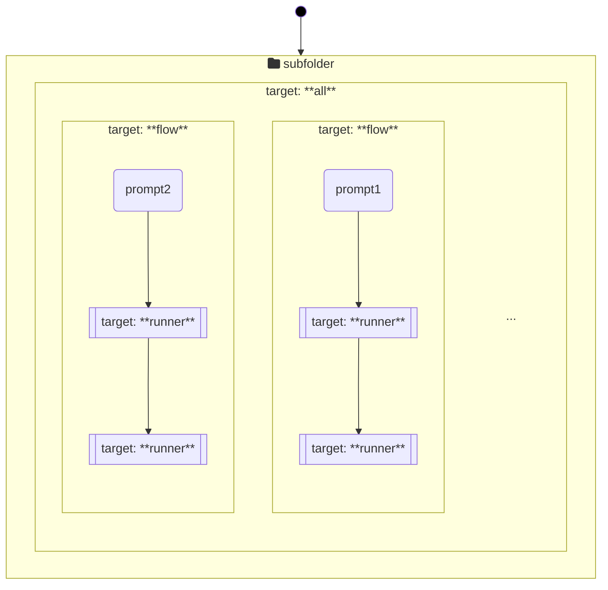

# Makefile設計ガイド
本文書はMakefileの実行およびスタイリングに関する設計ガイドを提供する。

## 初期化
共通設定は`./make/default.mk`に定義する。

各サブディレクトリのMakefileは上位のMakefileのsubmakeとして呼ばれるため、初期設定は省略する[^1]。

[^1]: `$MAKEFILES`にて共通設定ファイルを指定するため。

## 実行フロー
以下となるよう実装する。

### `all` target
- subfolder内のdefault targetとして作成する。
- 一番外側のコンテナとして機能し、各`flow` target(s)を呼び出す。
	- `flow` targetsを依存関係として持たせることで実装する。
- 実行順の制御にはmakeの機能を利用し、依存関係の記載順序(FIFO)にて制御する。
### `flow` target
- 制御フローを実装し、システムに変更を伴うコマンドは実行しない。
- 他、実行時のエラーハンドリングのためのpromptingを実装する。
- 基本的には`.PHONY` targetとして作成する。
- 実行順の制御には依存関係を用いない[^2]。
	- 代わりに、実行コマンドの順序にて順番を制御する。
	- 必要に応じて、`$(MAKE) runner target`を使い直接`runner` targetを呼び出す。
- `$(MAKE)`実行の度に変数展開が行われるため、再帰的変数でなくとも、`$(MAKE)`が呼ばれたタイミングで変数が展開される。
[^2]: 依存関係として指定すると、`runner` targetが先に実行され、promptingの実行制御ができない。
### `runner` target
- システムに変更を伴うコマンドを実装する。
- 一方、あるパターンでの実行要否の判断など、フローロジックを実装しない。
- 実行制御にはmakeの機能を利用し、ファイルが存在するかどうかで実行するかskipするかを制御する。
	- 基本的には`TARGET`のprefixを持つ変数にて指定する。
	- 複数ディレクトリを跨がって検索したい場合は、`vpath`にて対象ディレクトリを指定する。
	- ファイルを生成しないコマンドについては、`hoge.lock`などの.lockファイルを`touch`することで実行制御する。
	- 上記の場合、`${XDG_RUNTIME_DIR}`配下に.lockファイルを作成する。

## 変数
変数はSNAKE_CASEかつ、大文字で定義する。

用途に応じて、下記prefixを用いる。

|Prefix|What|How|
|--|--|--|
|**INSTALL**|`runner` targetとなるファイルパスを指定したい、かつ、`install` targetから呼び出される|絶対パスにて指定する
|**CHECK**|`runner` targetとなるファイルパスを指定したい、かつ、`check` targetから呼び出される|絶対パスにて指定する
|**INTERMEDIATE**| Makefileが生成する一時ファイルのパスを指定したい | Makefileからの相対パスにて指定する
|**ORIG**| Makefileがインプットとするファイルのパスを指定したい | 絶対パスにて指定する

また、用途に応じて、下記suffixも用いる。
|Suffix|What|How|
|--|--|--|
|**FILE**|各targetが参照するファイル(lockファイル以外)を指定したい|n/a
|**LOCK**|`runner` targetが参照するlockファイルを指定したい|ファイル名にて指定する

## 一時ファイル
一時ファイルはMakefileと同一ディレクトリに作成する。

ただし、コミットされないように当該ファイルを`.gitignore`に追加する。

# vim: set filetype=markdown:
